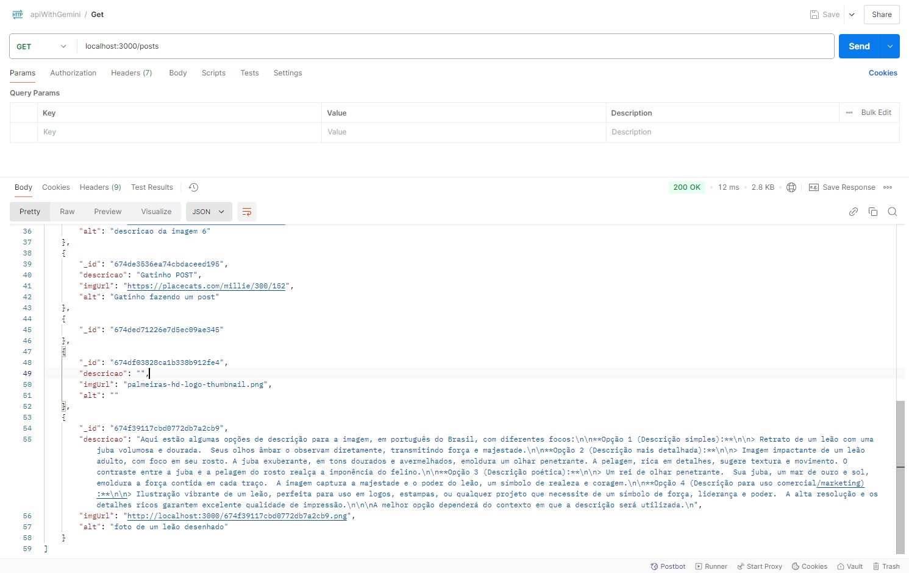

# API de Posts com Descrição de Imagens usando Express.js e MongoDB Atlas

Este projeto é uma API construída com Express.js que permite fazer operações de GET e POST em um banco de dados MongoDB Atlas. Além disso, utiliza o serviço Gemini para gerar descrições de imagens.



## Funcionalidades

-    **Listar Posts**: Recupera todos os posts do banco de dados.

-    **Criar Post**: Adiciona um novo post ao banco de dados.

-    **Upload de Imagem**: Faz upload de uma imagem e cria um post associado.

-    **Atualizar Post**: Atualiza um post existente com uma descrição gerada pelo serviço Gemini.

## Tecnologias Utilizadas

-    Node.js

-    Express.js

-    MongoDB Atlas

-    Multer (para upload de arquivos)

-    Gemini (para geração de descrições de imagens)

## Instalação

1. Clone o repositório:

```sh

git clone https://github.com/seu-usuario/seu-repositorio.git

cd seu-repositorio

```

2. Instale as dependências:

```sh
npm  install
```

## Configuração

```properties

STRING_CONEXAO = <sua-string-de-conexao-mongodb>

GEMINI_API_KEY = <sua-chave-api-gemini>

```

# Endpoints

### Listar Posts

-    **GET** `/posts`
-    Retorna todos os posts do banco de dados.

### Criar Post

-    **POST** `/posts`
-    Cria um novo post.
-    Corpo da requisição (JSON):

Aqui está um exemplo de README para o seu projeto:

````markdown
# API de Posts com Descrição de Imagens usando Express.js e MongoDB Atlas

Este projeto é uma API construída com Express.js que permite fazer operações de GET e POST em um banco de dados MongoDB Atlas. Além disso, utiliza o serviço Gemini para gerar descrições de imagens.

## Funcionalidades

-    **Listar Posts**: Recupera todos os posts do banco de dados.
-    **Criar Post**: Adiciona um novo post ao banco de dados.
-    **Upload de Imagem**: Faz upload de uma imagem e cria um post associado.
-    **Atualizar Post**: Atualiza um post existente com uma descrição gerada pelo serviço Gemini.

## Tecnologias Utilizadas

-    Node.js
-    Express.js
-    MongoDB Atlas
-    Multer (para upload de arquivos)
-    Gemini (para geração de descrições de imagens)

## Instalação

1. Clone o repositório:
     ```sh
     git clone https://github.com/seu-usuario/seu-repositorio.git
     cd seu-repositorio
     ```
````

2. Instale as dependências:

     ```sh
     npm install
     ```

3. Configure as variáveis de ambiente:
   Crie um arquivo

.env

na raiz do projeto e adicione a string de conexão do MongoDB Atlas e a chave da API do Gemini:

```properties
STRING_CONEXAO=mongodb+srv://<usuario>:<senha>@cluster0.mongodb.net/?retryWrites=true&w=majority
GEMINI_API_KEY=sua-chave-api-gemini
```

## Uso

1. Inicie o servidor:

     ```sh
     npm run dev
     ```

2. Acesse a API em `http://localhost:3000`.

## Endpoints

### Listar Posts

-    **GET** `/posts`
-    Retorna todos os posts do banco de dados.

### Criar Post

-    **POST** `/posts`
-    Cria um novo post.
-    Corpo da requisição (JSON):
     ```json
     {
          "titulo": "Meu Post",
          "conteudo": "Este é o conteúdo do meu post."
     }
     ```

### Upload de Imagem

-    **POST** `/upload`
-    Faz upload de uma imagem e cria um post associado.
-    Corpo da requisição (form-data):
     -    Campo `imagem`: Arquivo de imagem a ser carregado.

### Atualizar Post

-    **PUT** `/upload/:id`
-    Atualiza um post existente com uma descrição gerada pelo serviço Gemini.
-    Parâmetros:
     -    `id`: ID do post a ser atualizado.

